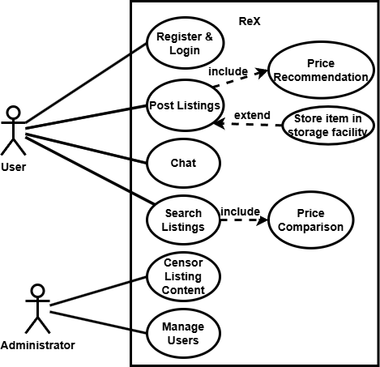
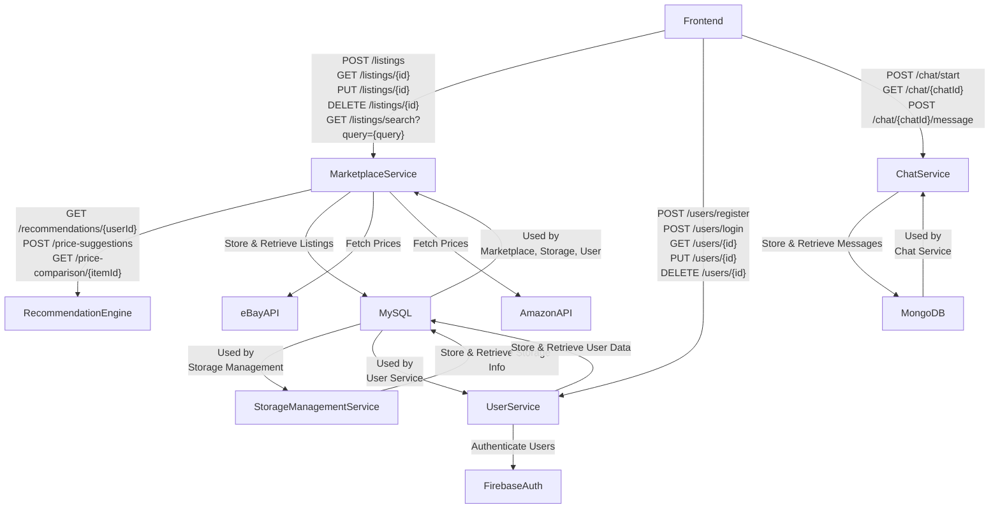
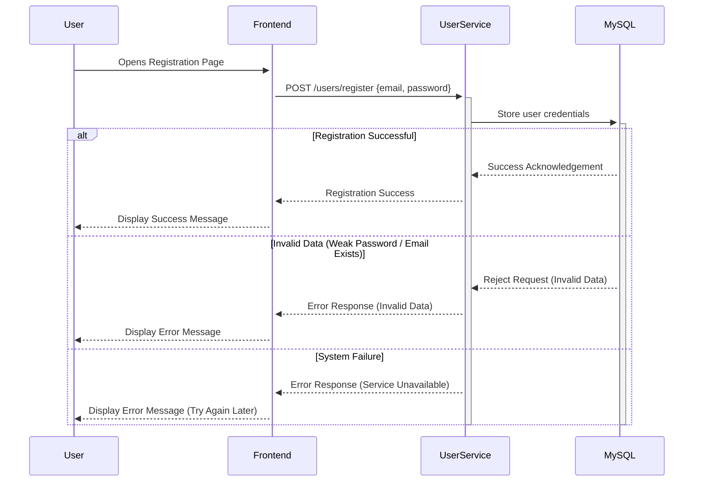
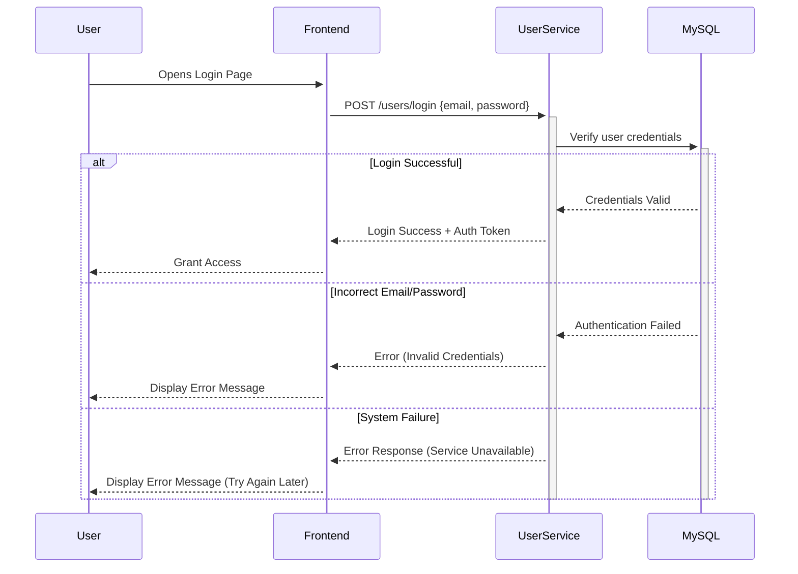
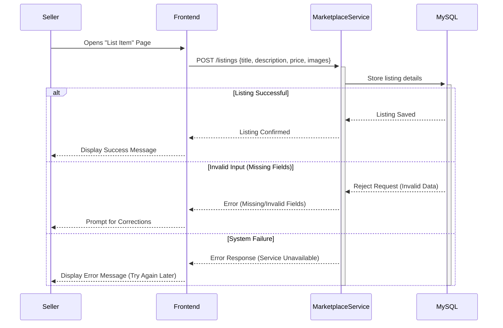
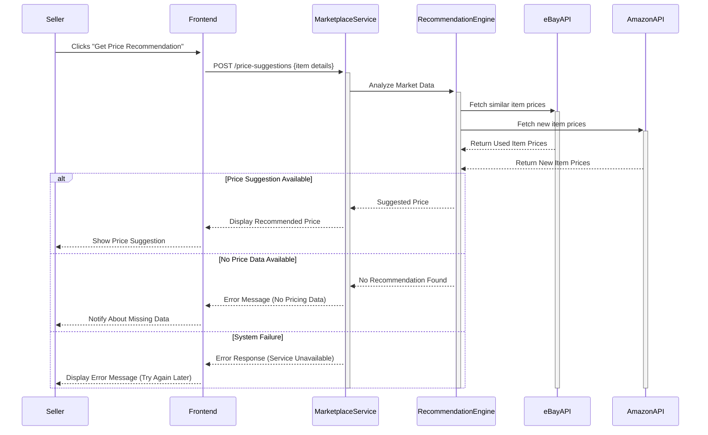
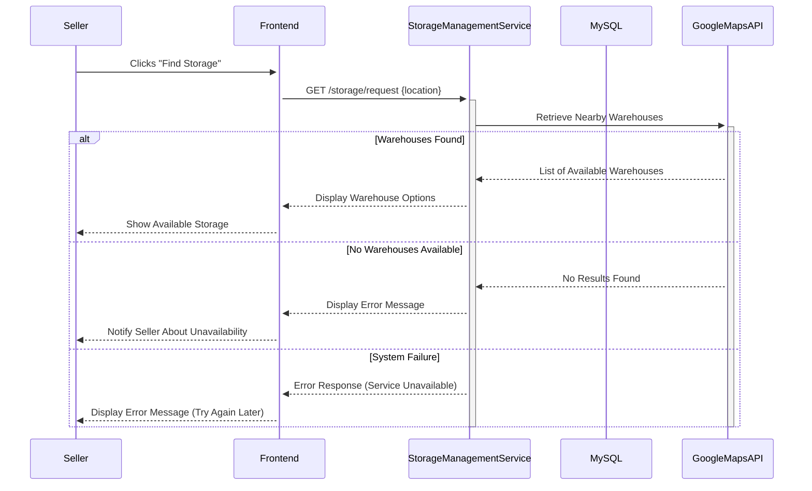
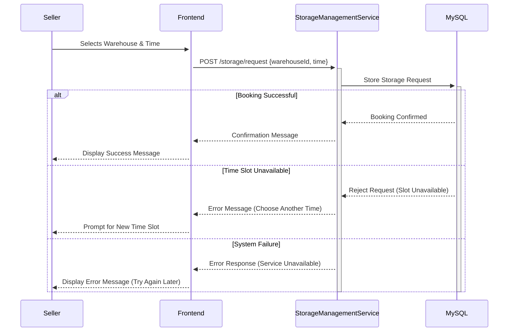

# M3 - Requirements and Design

## 1. Change History
Removed administrator and storage use cases, since they are not needed.
Change requirement specification to correct format.
Reworded backend example's explanation for better understanding

## 2. Project Description
ReX is a local second-hand marketplace for buying and selling pre-owned items. When relocating or decluttering, sellers can instantly offload their items to partner warehouses, where they’re securely stored until sold. This prevents waste, preserves value, and lets sellers move forward stress-free.

The app integrates Google Maps API to help users find the nearest storage facilities, making it easy to choose the most convenient option. Once stored, items are listed with detailed descriptions and photos on the platform. Additionally, our app integrates a price recommendation and comparison feature. It analyzes the prices of similar second-hand items in our database and the past transaction prices to suggest a fair and competitive price for sellers. Furthermore, the app compares the listing price with the market price of similar new items from other platforms (e.g. eBay, Amazon), showcasing potential savings for buyers. This innovative feature ensures sellers get the best value while enhancing buyer satisfaction by highlighting the cost-effectiveness of second-hand purchases.

Buyers benefit from a personalized recommendation system and real-time chat functionality for seamless communication and a customized shopping experience. Whether buyers prefer self-pickup from the warehouse or delivery, the app simplifies the entire process, making second-hand trading faster, more efficient, and ultimately more rewarding for all users.

## 3. Requirements Specification
### **3.1. Use-Case Diagram**


### **3.2. Actors Description**
1. **[User]**: User is the people uses the app. They can act as a buyer who wants to purchase second-hand items, browse listings and chat with sellers. They can also act as a seller when they wants to list unwanted items for sale. They can deposit their items in partner warehouses, post product listings, and manage their listings.

### **3.3. Functional Requirements**
<a name="fr1"></a>

1. **[Register and Login]** 
    - **Overview**:
        1. Google-based User Registration
        2. Google-based User Login

    - **Detailed Flow for Each Independent Scenario**: 
        1. **[Google-based User Registration]**:
            - **Description**: Users register with their Google accounts. Upon successful registration, they can set preferences for personalized recommendations.
            - **Primary actor(s)**: User
            - **Main success scenario**:
                1. User opens the app and selects the "Sign in with Google" option.
                2. The system initiates Google OAuth authentication.
                3. Google verifies the user credentials and provides user data (e.g., email, name).
                4. The app creates a new account in the system or fetches an existing account based on the Google ID.
                5. The user sets preferences (e.g., categories of interest) for product recommendations.

            - **Failure scenario(s)**:
                - 3a. Google authentication fails due to network issues.
                    - 3a1. System displays an error message indicating authentication failure.
                    - 3a2. User retries the authentication process after resolving the issue.

                - 3b. Google account does not return necessary data.
                    - 3b1. System notifies the user of the incomplete data.
                    - 3b2. User retries with a valid Google account.

        2. **[Google-based User Login]**:
            - **Description**: Returning users log in using their Google accounts, and their preferences are retained for personalized recommendations.
            - **Primary actor(s)**: User
            - **Main success scenario**:
                1. User selects the "Sign in with Google" option on the login screen.
                2. The system verifies the user’s Google account and fetches the corresponding system account.
                3. The app grants the user access to their dashboard with personalized product recommendations.

            - **Failure scenario(s)**:
                - 2a. Google account authentication fails due to incorrect credentials.
                    - 2a1. System displays an error message indicating authentication failure.
                    - 2a2. User retries with correct credentials.

                - 2b. The system cannot connect to Google's authentication service.
                    - 2b1. System displays a message about Google service downtime.
                    - 2b2. User is advised to try again later.


2. **[Post Listings]** 
    - **Overview**:
        1. Upload item details
        2. Price recommendation

    - **Detailed Flow for Each Independent Scenario**: 
        1. **[User Registration]**:
            - **Description**: User can upload item photos, descriptions, and set prices.
            - **Primary actor(s)**: User
            - **Main success scenario**:
                1. User selects the "List Item" option.
                2. User uploads photos and fills in item details (e.g., description).
                3. The system verifies the details and accepts the listing.

            - **Failure scenario(s)**:
                - 2a. User uploads incomplete or invalid details.
                    - 2a1. System displays an error message highlighting missing/invalid fields.
                    - 2a2. User corrects the errors and resubmits the details.
                - 3a. System is down during registration.
                    - 3a1. User receives a message indicating temporary unavailability.
                    - 3a2. User is asked to try again later.
                
        2. **[Price Recommendation]**:
            - **Description**: The system suggests a competitive price based on database analysis and comparison with new item prices on other platforms.
            - **Primary actor(s)**: User
            - **Main success scenario**:
                1. User enters item details and clicks "Get Price Recommendation".
                2. System analyzes the database and provides a price suggestion.
                3. System also compares the price to new item prices and displays the difference.
                4. User accepts the recommendation or sets a custom price.

            - **Failure scenario(s)**:
                - 2a. Price recommendation fails due to missing database data.
                    - 2a1. System notifies the user about the issue.
                    - 2a2. User can proceed without the recommendation.

                - 2b. System cannot fetch competitor prices.
                    - 2b1. System displays a message about unavailability of competitor price data.
                    - 2b2. User proceeds with the recommended price based on internal data.
3. **[Chat]**
    - **Overview**:
        1. Enable real-time messaging between buyers and sellers.
        2. Store chat history for future reference.

    - **Detailed Flow for Each Independent Scenario**:
        1. **[Initiate Chat]**:
            - **Description**: User can start a conversation with another user regarding a listing.
            - **Primary actor(s)**: User
            - **Main success scenario**:
                1. Buyer clicks on "Chat" from the listing page.
                2. System opens a chat window and establishes a connection.
                3. Buyer and Seller can exchange messages in real time.
                4. System stores the conversation history.
            
            - **Failure scenario(s)**:
                - 2a. Network issues prevent connection.
                    - 2a1. System displays an error message about network unavailability.
                    - 2a2. User retries when network is restored.
                - 3a. Message delivery fails.
                    - 3a1. System notifies sender that message was not sent.
                    - 3a2. System retries sending the message.

4. **[Search Listings]**
    - **Overview**:
        1. Allow users to search for available listings based on various filters.
        2. Provide an intuitive search experience with relevant results.
    
    - **Detailed Flow for Each Independent Scenario**:
        1. **[Perform Search]**:
            - **Description**: User can search for listings using keywords and filters.
            - **Primary actor(s)**: User
            - **Main success scenario**:
                1. User enters a keyword in the search bar.
                2. User applies filters (e.g., price range, category, location).
                3. System processes the request and returns matching listings.
            
            - **Failure scenario(s)**:
                - 2a. No matching listings found.
                    - 2a1. System displays a message indicating no results were found.
                    - 2a2. System suggests alternative search terms.
                - 3a. System is slow or unresponsive.
                    - 3a1. System notifies the user of a delay.
                    - 3a2. User retries the search.

5. **[Price Recommendation]**
    - **Overview**:
        1. Assist users in setting a competitive price for their listings.
        2. Utilize historical data and market trends for recommendations.
    
    - **Detailed Flow for Each Independent Scenario**:
        1. **[Generate Price Recommendation]**:
            - **Description**: System suggests a suitable price based on similar listings.
            - **Primary actor(s)**: User
            - **Main success scenario**:
                1. User enters item details when creating a listing.
                2. System retrieves similar listings and analyzes market trends.
                3. System displays a recommended price range.
            
            - **Failure scenario(s)**:
                - 2a. Insufficient historical data available.
                    - 2a1. System informs the user that no recommendation is available.
                    - 2a2. User manually enters a price.
                - 3a. System fails to process recommendations.
                    - 3a1. System notifies user of the issue.
                    - 3a2. User proceeds without recommendations.

6. **[Price Comparison]**
    - **Overview**:
        1. Enable users to compare prices of similar items.
        2. Provide insights into price variations across listings.
    
    - **Detailed Flow for Each Independent Scenario**:
        1. **[Compare Prices]**:
            - **Description**: User can compare the prices of similar items in search results.
            - **Primary actor(s)**: User
            - **Main success scenario**:
                1. User performs a search for a specific item.
                2. System retrieves similar listings.
                3. System displays a price comparison chart or summary.
            
            - **Failure scenario(s)**:
                - 2a. No similar listings available.
                    - 2a1. System notifies user that no comparisons can be made.
                    - 2a2. User proceeds with regular search results.
                - 3a. System fails to generate a comparison.
                    - 3a1. System informs user of an error.
                    - 3a2. User retries comparison later.


### **3.4. Screen Mockups**


### **3.5. Non-Functional Requirements**
<a name="nfr1"></a>

1. **[System Performance]**
   - **Description**: The system should support multiple users simultaneously and ensure startup within 5 seconds and most pages load within 2 seconds.
   - **Justification**: According to Android vitals at the Android developer page, code startup should take less than 5 seconds, warm startup should take less than 1 seconds and hot startup should take less than 1.5 seconds.

<a name="nfr2"></a>

2. **[Data Security]**
   - **Description**: The system should safeguard users' personal information (e.g., login details, order data) against unauthorized access or breaches.
   - **Justification**: Protecting user data builds trust and ensures users feel safe while using the platform.

<a name="nfr3"></a>

3. **[System Availability]**
   - **Description**: The system should minimize downtime, with no more than 1 hour of unavailability per month.
   - **Justification**: Ensuring high availability allows users to access critical functionalities like placing orders or logging in at any time.


## 4. Design Specification
### **4.1. Main Components**
1. **Marketplace Service**
    - **Purpose**: Handles product listings, pricing, and search functionality.
    - **Database Schema**:
        - **`listings` Table**:
            ```sql
            CREATE TABLE listings(
                id INT AUTO_INCREMENT PRIMARY KEY,
                title VARCHAR(255) NOT NULL,
                description TEXT,
                price DECIMAL(10,2) NOT NULL,
                seller_id VARCHAR(25) NOT NULL,
                latitude DECIMAL(9,6),
                longitude DECIMAL(9,6),
                created_at TIMESTAMP DEFAULT CURRENT_TIMESTAMP
            );
            ```
        - **`listing_images` Table**:
            ```sql
            CREATE TABLE listing_images(
                id INT AUTO_INCREMENT PRIMARY KEY,
                listing_id INT NOT NULL,
                image_url TEXT NOT NULL,
                FOREIGN KEY (listing_id) REFERENCES listings(id) ON DELETE CASCADE
            );
            ```

    - **Interfaces**:

        ###### **1️. POST /listings** - Creates a new product listing.
        - **Request Body (JSON):**
            ```json
            {
                "title": "Laptop",
                "description": "Used Dell laptop, great condition",
                "price": 499.99,
                "seller_id": 123,
                "latitude": 49.2827,
                "longitude": -123.1207,
                "images": [
                    "https://example.com/image1.jpg",
                    "https://example.com/image2.jpg"
                ]
            }
            ```
        - **Response:**
            - **Success (201 Created)**:
                ```json
                {
                    "id": 1,
                    "message": "Listing created successfully"
                }
                ```
            - **Failure (400 Bad Request, missing fields):**
                ```json
                {
                    "error": "Missing required fields"
                }
                ```
        - **Input Limits:**
            - `title`: Max **255** characters.
            - `description`: No strict limit.
            - `price`: Max **99999999.99**.
            - `seller_id`: Must be an **existing user ID**.
            - `latitude` / `longitude`: Optional, must be valid geolocation coordinates.
            - `images`: Each URL max **500** characters, up to **10 images** per listing.

        ---

        ###### **2️. GET /listings?id={id}** - Retrieves details of a specific listing.
        - **Response:**
            - **Success (200 OK)**:
                ```json
                {
                    "id": 1,
                    "title": "Laptop",
                    "description": "Used Dell laptop, great condition",
                    "price": 499.99,
                    "seller_id": 123,
                    "latitude": 49.2827,
                    "longitude": -123.1207,
                    "created_at": "2025-02-16T00:17:28Z",
                    "images": [
                        "https://example.com/image1.jpg",
                        "https://example.com/image2.jpg"
                    ]
                }
                ```
            - **Failure (404 Not Found):**
                ```json
                {
                    "error": "Listing not found"
                }
                ```

        ---

        ###### **3️. PUT /listings/{id}** - Updates an existing listing.
        - **Request Body (Only fields to update):**
            ```json
            {
                "title": "Updated Laptop Title",
                "price": 450.00,
                "latitude": 49.2800,
                "longitude": -123.1200,
                "images": [
                    "https://example.com/new_image.jpg"
                ]
            }
            ```
        - **Response:**
            - **Success (200 OK)**:
                ```json
                {
                    "message": "Listing updated successfully"
                }
                ```
            - **Failure (400 Bad Request / 404 Not Found):**
                ```json
                {
                    "error": "Invalid update request or listing not found"
                }
                ```
        - **Update Rules:**
            - `title`: Optional, Max **255** characters.
            - `description`: Optional.
            - `price`: Optional, must be **greater than 0**.
            - `latitude` / `longitude`: Optional.
            - `images`: Optional, **replaces all previous images**.
            - **Only listing owners (seller_id match) can edit a listing**.

        ---

        ###### **4️. DELETE /listings/{id}** - Removes a listing from the marketplace.
        - **Response:**
            - **Success (200 OK):**
                ```json
                {
                    "message": "Listing deleted successfully"
                }
                ```
            - **Failure (404 Not Found):**
                ```json
                {
                    "error": "Listing not found"
                }
                ```
        - **Effect of Deletion:**
            - **Cascading delete**: All associated images in `listing_images` table are **automatically removed**.

        ---

        ###### **5️. GET /listings/search?query={query}** - Searches for listings using keywords.
        - **Query Parameters:**
            - `query`: Searches in `title` and `description` (case-insensitive).

        - **Example Queries:**
            - **Basic search by keyword (`query`)**
                ```
                https://nsefhqsvqf.execute-api.us-east-2.amazonaws.com/listings/search?query=bike
                ```

        - **Response:**
            - **Success (200 OK, Matching Listings):**
                ```json
                {
                    "results": [
                        {
                            "id": 1,
                            "title": "Mountain Bike",
                            "description": "High-quality bike, barely used.",
                            "price": 299.99,
                            "latitude": 49.2827,
                            "longitude": -123.1207,
                            "image": "https://example.com/bike1.jpg"
                        },
                        {
                            "id": 2,
                            "title": "Road Bicycle",
                            "description": "Lightweight and fast!",
                            "price": 599.99,
                            "latitude": 49.3000,
                            "longitude": -123.1150,
                            "image": "https://example.com/bike2.jpg"
                        }
                    ]
                }
                ```
            - **Failure (404 Not Found):**
                ```json
                {
                    "error": "No listings match your search"
                }
                ```
        - **Search Rules:**
            - `query`: Max **255** characters.
            - `min_price` / `max_price`: Must be **positive numbers**.
            - `latitude` / `longitude`: Must be valid geographic coordinates.
            - If no listings match, return `404`.

2. **User Service**
    - **Purpose**: The User Service manages user profiles, preferences, and geolocation. It does not handle authentication, as this is managed by Google OAuth.
    - **interfaces**:
    ###### **2.1. POST /users/register** - Registers a new user
    - **Request Body (JSON):**
        ```json
        {
            "google_id": "103217936482731253672",
            "email": "user@example.com",
            "username": "john_doe",
            "preferences": ["electronics", "furniture"],
            "latitude": 49.2827,
            "longitude": -123.1207
        }
        ```
    - **Response:**
        - **Success (201 Created):**
            ```json
            {
                "message": "User registered successfully",
                "user_id": "103217936482731253672"
            }
            ```
    ---

    ###### **2.2. GET /users/{id}** - Retrieves user profile

    - **Request Example:**
        ```http
        GET /users/103217936482731253672
        ```
    - **Response:**
        - **Success (200 OK):**
            ```json
            {
                "google_id": "103217936482731253672",
                "email": "user@example.com",
                "username": "john_doe",
                "preferences": ["electronics", "furniture"],
                "latitude": 49.2827,
                "longitude": -123.1207
            }
            ```
    ---

    ###### **2.3. PUT /users/{id}** - Updates user details
    - **Request Body (JSON):**
        ```json
        {
            "username": "johndoe_new",
            "preferences": ["books", "gaming"],
            "latitude": 49.2900,
            "longitude": -123.1000
        }
        ```
    - **Response:**
        - **Success (200 OK):**
            ```json
            {
                "message": "User updated successfully"
            }
            ```
    ---

    ###### **2.4. DELETE /users/{id}** - Deletes a user account
    - **Request Example:**
        ```http
        DELETE /users/103217936482731253672
        ```
    - **Response:**
        - **Success (200 OK):**
            ```json
            {
                "message": "User deleted successfully"
            }
            ```
    ---

    ###### 3️. Database Schema
    The service maintains a single table where each row represents a user. It includes:
    - **Google ID** as the primary key.
    - **Email** (unique for each user).
    - **Optional username** (if set).
    - **Preferences** (stored as JSON).
    - **Geolocation** (latitude and longitude for location-based features).

    ---

    ###### 4️. Notes
    - Authentication is fully handled by Google OAuth.
    - Passwords are **not stored** in this service.
    - Preferences allow users to personalize their recommendations.
    - Location data enables nearby service suggestions.

---

4. **Recommendation Engine**
    - **Purpose**: Provides price suggestions and personalized recommendations.
    - **Interfaces**:

        ###### **1️. GET /recommendations/{userId}** - Fetches personalized item recommendations.
        - **Description**: Retrieves relevant listings based on the user's saved preferences.
        - **Process**:
            1. Queries the **User Service** to get the user's preferences.
            2. Uses the retrieved keywords to search the **Listings Service**.
            3. Returns a list of relevant listings.
        - **Response Example**:
            ```json
            {
                "userId": "103217936482731253672",
                "recommended_items": [
                    {
                        "name": "Mountain Bike",
                        "price": 299.99,
                        "url": "https://example.com/listing/123"
                    },
                    {
                        "name": "Road Bicycle",
                        "price": 350.00,
                        "url": "https://example.com/listing/456"
                    }
                ]
            }
            ```
        
        ---

        ###### **2️. POST /price-suggestions** - Suggests a price for a new listing.
        - **Description**: Provides a price recommendation based on internal listings and external data sources.
        - **Request Body (JSON)**:
            ```json
            {
                "keyword": "bike"
            }
            ```
        - **Process**:
            1. Queries the **Listings Service** for similar second-hand items.
            2. Fetches price data from **eBay API** and **Amazon API**.
            3. Computes an aggregated **best price** recommendation.
        - **Response Example**:
            ```json
            {
                "best_price": 320.00,
                "similar_items": [
                    {
                        "name": "Used Mountain Bike",
                        "price": 299.99,
                        "url": "https://example.com/listing/123"
                    },
                    {
                        "name": "New Bike (Amazon)",
                        "price": 500.00,
                        "url": "https://amazon.com/example-bike"
                    }
                ]
            }
            ```

        ---

        ###### **3️. GET /price-comparison/{itemId}** - Retrieves price comparisons from external sources.
        - **Description**: Compares the price of a given listing to similar items and provides a pricing insight.
        - **Process**:
            1. Retrieves the item details from the **Listings Service**.
            2. Fetches similar listings and new item prices from **eBay API** and **Amazon API**.
            3. Computes the **market price** and determines if the item is underpriced, fair, or overpriced.
        - **Response Example**:
            ```json
            {
                "original_item": {
                    "name": "Used Gaming Laptop",
                    "price": 800.00,
                    "url": "https://example.com/listing/12345"
                },
                "similar_items": [
                    {
                        "name": "Refurbished Gaming Laptop",
                        "price": 750.00,
                        "url": "https://example.com/listing/67890"
                    },
                    {
                        "name": "New Gaming Laptop (Amazon)",
                        "price": 1200.00,
                        "url": "https://amazon.com/gaming-laptop"
                    }
                ],
                "message": "This item is priced below market value, it's a bargain!"
            }
            ```


5. **Chat Service**
    - **Purpose**: Manages buyer-seller chat functionality.
    - **Database Schema**:
        - **`chats` Table**:
            ```sql
            CREATE TABLE chats(
                id INT AUTO_INCREMENT PRIMARY KEY,
                buyer_id VARCHAR(25) NOT NULL,
                seller_id VARCHAR(25) NOT NULL,
                created_at TIMESTAMP DEFAULT CURRENT_TIMESTAMP
            );
            ```
        - **`messages` Table**:
            ```sql
            CREATE TABLE messages(
                id INT AUTO_INCREMENT PRIMARY KEY,
                chat_id INT NOT NULL,
                sender_id VARCHAR(25) NOT NULL,
                message TEXT NOT NULL,
                timestamp TIMESTAMP DEFAULT CURRENT_TIMESTAMP,
                FOREIGN KEY (chat_id) REFERENCES chats(id) ON DELETE CASCADE
            );
            ```
    - **Interfaces**:
        - `POST /chat/start` - Initiates a chat between a buyer and seller.
        - **Request Body (JSON):**
        ```json
        {
            "buyerId": "1",
            "sellerId": "2"
        }
        ```
        ---
        - `GET /chat/{chatId}` - Retrieves chat history.
        ---
        - `POST /chat/{chatId}/message` - Sends a new message.
        - **Request Body (JSON):**
        ```json
        {
            "senderId": "1",
            "message": "hello"
        }
        ```
    ---

### **4.4. Frameworks**
- **Cloud Provider**: AWS
- **Backend Framework**: Node.js with Express.js
- **Frontend Framework**: Native Kotlin for Android
- **Databases**: MongoDB (Atlas) for chat, MySQL (AWS RDS) for listings & user data
- **Other Tools**: Docker, Kubernetes, Redis, Firebase Auth, AWS API Gateway

### **4.5. Dependencies Diagram**


### **4.6. Functional Requirements Sequence Diagram**

#### **User Registration**


#### **User Login**


#### **Listing an Item for Sale**


#### **Price Recommendation**


#### **Finding Nearby Storage Facility**


#### **Drop-off Scehduleing**


### **3.5. Non-Functional Requirements**
<a name="nfr1"></a>

1. **[System Performance]**
   - **Implementation**:
     - Use **caching (Redis)** to reduce database queries.
     - Optimize **database indexing and queries** for fast retrieval.
     - Deploy on **AWS with auto-scaling** to handle peak loads.

<a name="nfr2"></a>

2. **[Data Security]**
   - **Implementation**:
     - Use **Firebase Authentication** for secure login and access control.
     - Encrypt **sensitive user data** (bcrypt for passwords, database encryption).

<a name="nfr3"></a>

3. **[System Availability]**
   - **Implementation**:
     - Monitor system health with **AWS CloudWatch and alerts**.
     - Perform **zero-downtime deployments** using rolling updates.


### **4.8. Main Project Complexity Design**
#### **AI-Enhanced Price Recommendation Engine**
- **Description**: The price recommendation engine analyzes historical pricing data, fetches real-time prices from external sources (eBay, Amazon), and integrates AI (ChatGPT API) to improve search accuracy by correcting user input, suggesting related products, and enhancing query relevance.
- **Why complex?**: 
  - **Multi-source data processing**: Merging internal price data with external APIs.
  - **AI-driven query refinement**: Handling ambiguous product names, typos, and missing details.
  - **Computational efficiency**: Managing API rate limits, caching results, and filtering outliers.
- **Design**:
    - **Input**: Item title, description, category, condition (from user input).
    - **Output**: Suggested competitive price, AI-refined query, price breakdown.
    - **Main computational logic**:
        1. Use **ChatGPT API** to refine user input and correct errors.
        2. Fetch **historical price data** from the internal database (MySQL).
        3. Query **eBay & Amazon APIs** using the AI-enhanced search term.
        4. Filter **outliers** and compute a **weighted average price**.
        5. Return the **final price suggestion** with AI-processed insights.
    - **Pseudo-code**:
        ```python
        def recommend_price(item_details):
            refined_query = call_chatgpt_api(item_details["title"], item_details["category"])
            historical_prices = query_database(refined_query, item_details["condition"])
            ebay_prices = fetch_ebay_prices(refined_query, item_details["category"])
            amazon_prices = fetch_amazon_prices(refined_query, item_details["category"])
            all_prices = historical_prices + ebay_prices + amazon_prices
            filtered_prices = remove_outliers(all_prices)
            suggested_price = weighted_average(filtered_prices, weights={"historical": 0.5, "ebay": 0.25, "amazon": 0.25})
            return {"suggested_price": suggested_price, "refined_query": refined_query}
        ```


## 5. Contributions
- **[Tianrui Chu]**: Wrote the **Design Specification** section, including defining the system’s architecture, main components, databases, external APIs, and frameworks. Designed the **dependencies diagram** to illustrate interactions between microservices and external systems. Developed detailed **functional requirement sequence diagrams** using Mermaid to visualize system workflows. Spent around 5 hours on this assignment.
- **[Yichen Li]**: Contributed in Section 2 and 3. Draw and design the screen mockup. Spent around 4 hours on this assignment.
- **[Leyang Gao]**: I contributed to the project by helping to conceptualize the core idea of the second-hand marketplace platform, including its operational model and unique warehouse storage feature. I also participated in defining the functional and non-functional requirements in the M3 document and assisted in creating the PowerPoint presentation. Spent around 12 hours on this assignment.
- **[Dingxi Yang]**: Contributed on the use case diagram and helped proofread and format the documentation. Assisted on polishing PowerPoint presentation. Spent around 4 hours on this assignment.
