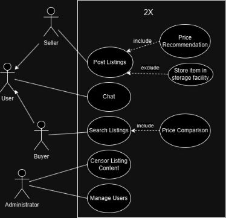
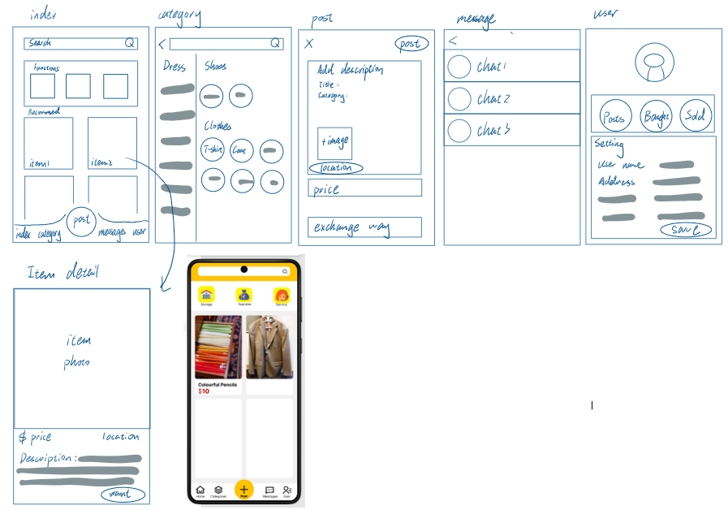
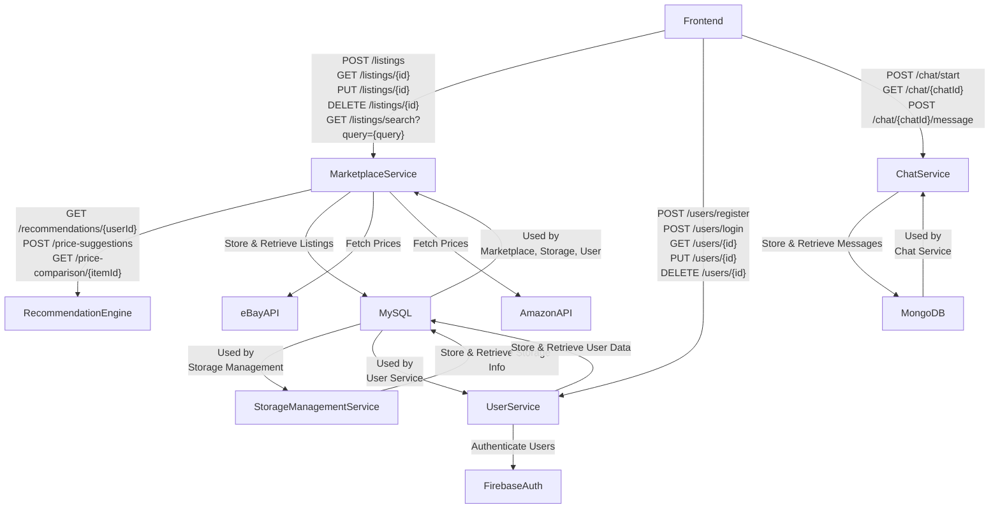
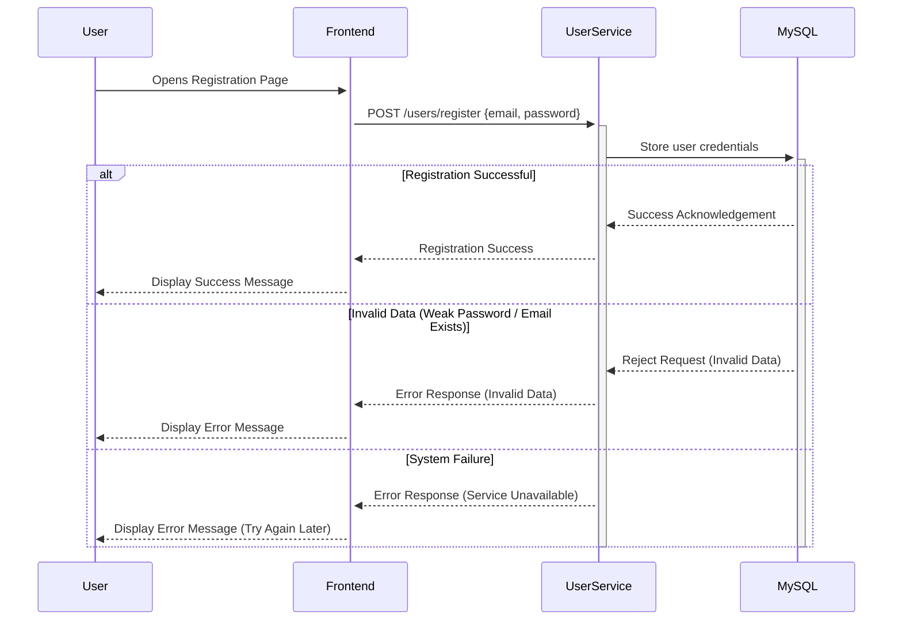
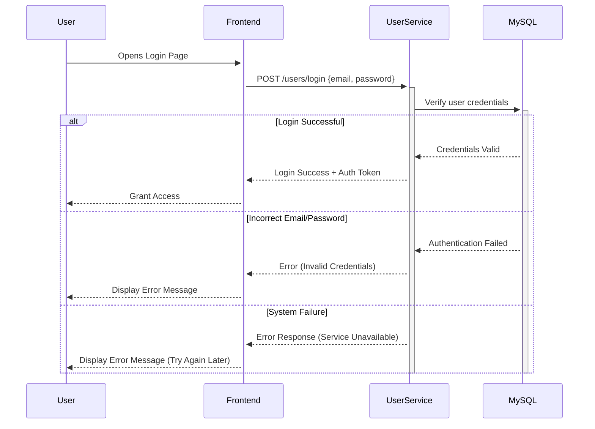
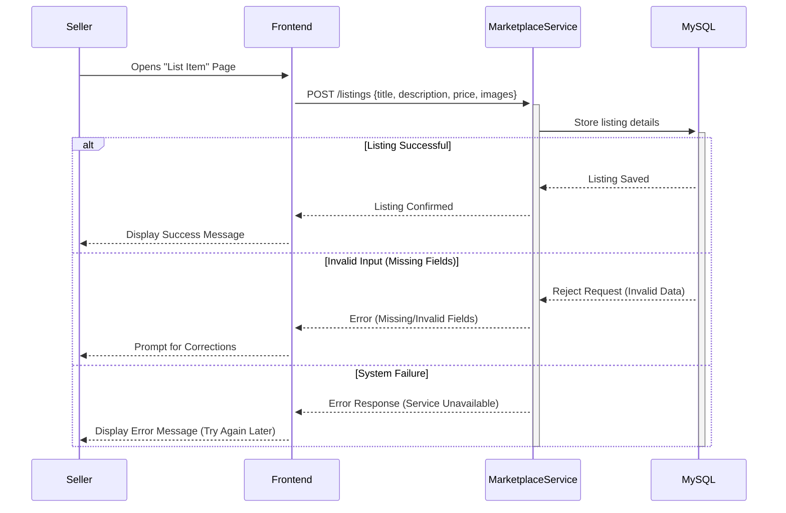
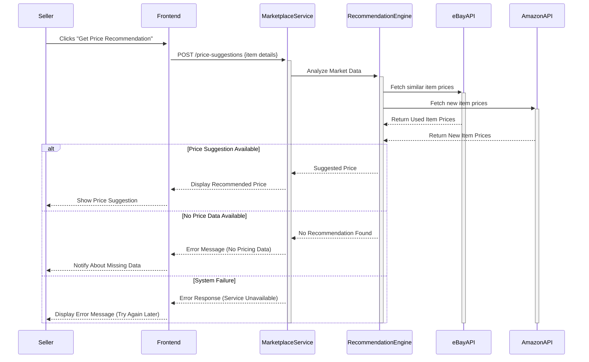
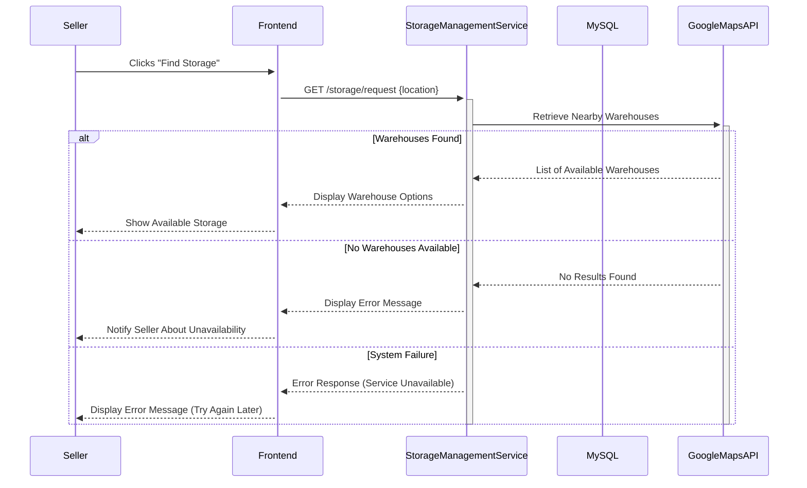
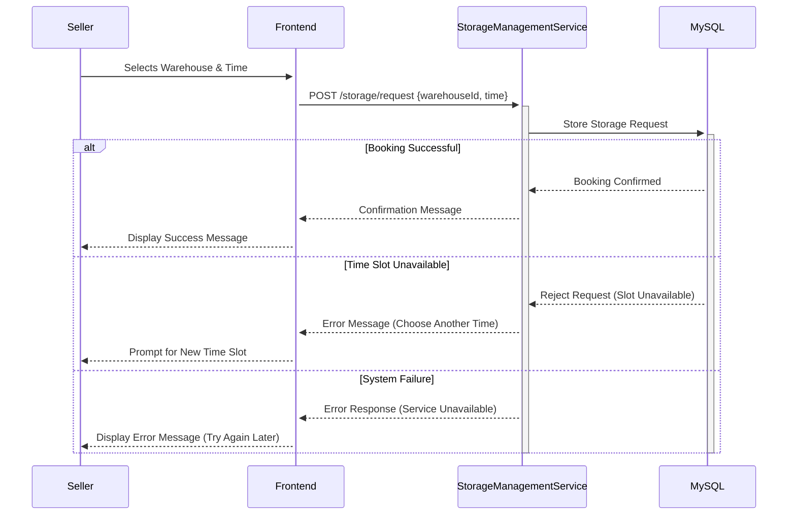

# M3 - Requirements and Design

## 1. Change History
<!-- Leave blank for M3 -->

## 2. Project Description
ReX is a local second-hand marketplace for buying and selling pre-owned items. When relocating or decluttering, sellers can instantly offload their items to partner warehouses, where they’re securely stored until sold. This prevents waste, preserves value, and lets sellers move forward stress-free.

The app integrates Google Maps API to help users find the nearest storage facilities, making it easy to choose the most convenient option. Once stored, items are listed with detailed descriptions and photos on the platform. Additionally, our app integrates a price recommendation and comparison feature. It analyzes the prices of similar second-hand items in our database and the past transaction prices to suggest a fair and competitive price for sellers.Furthermore, the app compares the listing price with the market price of similar new items from other platforms (e.g. eBay, Amazon), showcasing potential savings for buyers. This innovative feature ensures sellers get the best value while enhancing buyer satisfaction by highlighting the cost-effectiveness of second-hand purchases.

Buyers benefit from a personalized recommendation system and real-time chat functionality for seamless communication and a customized shopping experience. Whether buyers prefer self-pickup from the warehouse or delivery, the app simplifies the entire process, making second-hand trading faster, more efficient, and ultimately more rewarding for all users.

## 3. Requirements Specification
### **3.1. Use-Case Diagram**


### **3.2. Actors Description**
1. **[BUYERS]**: Buyers are users looking to purchase second-hand items. They can browse listings, communicate with sellers, and choose pickup or delivery options.
2. **[SELLERS]**: Sellers are users who wish to list unwanted items for sale. They can deposit their items in partner warehouses, post product listings, and manage their listings.
3. **[Administrator]**：The administrator ensures the smooth operation of the platform, including monitoring listings and handling user disputes.

### **3.3. Functional Requirements**
<a name="fr1"></a>

1. **[Register and Login]** 
    - **Overview**:
        1. Google-based User Registration
        2. Google-based User Login

    - **Detailed Flow for Each Independent Scenario**: 
        1. **[Google-based User Registration]**:
            - **Description**: Users register with their Google accounts. Upon successful registration, they can set preferences for personalized recommendations.
            - **Primary actor(s)**: Sellers, Buyers
            - **Main success scenario**:
                1. User opens the app and selects the "Sign in with Google" option.
                2. The system initiates Google OAuth authentication.
                3. Google verifies the user credentials and provides user data (e.g., email, name).
                4. The app creates a new account in the system or fetches an existing account based on the Google ID.
                5. The user sets preferences (e.g., categories of interest) for product recommendations.

            - **Failure scenario(s)**:
                - 1a. Google authentication fails due to network issues.
                    - 1a1. System displays an error message indicating authentication failure.
                    - 1a2. User retries the authentication process after resolving the issue.

                - 1b. Google account does not return necessary data.
                    - 1b1. System notifies the user of the incomplete data.
                    - 1b2. User retries with a valid Google account.

        2. **[Google-based User Login]**:
            - **Description**: Returning users log in using their Google accounts, and their preferences are retained for personalized recommendations.
            - **Primary actor(s)**: Sellers, Buyers
            - **Main success scenario**:
                1. User selects the "Sign in with Google" option on the login screen.
                2. The system verifies the user’s Google account and fetches the corresponding system account.
                3. The app grants the user access to their dashboard with personalized product recommendations.

            - **Failure scenario(s)**:
                - 2a. Google account authentication fails due to incorrect credentials.
                    - 2a1. System displays an error message indicating authentication failure.
                    - 2a2. User retries with correct credentials.

                - 2b. The system cannot connect to Google's authentication service.
                    - 2b1. System displays a message about Google service downtime.
                    - 2b2. User is advised to try again later.


2. **[List an Item for Sale]** 
    - **Overview**:
        1. Upload item details
        2. Price recommendation

    - **Detailed Flow for Each Independent Scenario**: 
        1. **[User Registration]**:
            - **Description**: Sellers can upload item photos, descriptions, and set prices.
            - **Primary actor(s)**: Sellers
            - **Main success scenario**:
                1. Seller selects the "List Item" option.
                2. Seller uploads photos and fills in item details (e.g., description).
                3. The system verifies the details and accepts the listing.

            - **Failure scenario(s)**:
                - 1a. Seller uploads incomplete or invalid details.
                    - 1a1. System displays an error message highlighting missing/invalid fields.
                    - 1a2. Seller corrects the errors and resubmits the details.
                - 1b. System is down during registration.
                    - 1b1. User receives a message indicating temporary unavailability.
                    - 1b2. User is asked to try again later.
                
        2. **[Price Recommendation]**:
            - **Description**: The system suggests a competitive price based on database analysis and comparison with new item prices on other platforms.
            - **Primary actor(s)**: Sellers
            - **Main success scenario**:
                1. Seller enters item details and clicks "Get Price Recommendation".
                2. System analyzes the database and provides a price suggestion.
                3. System also compares the price to new item prices and displays the difference.
                4. Seller accepts the recommendation or sets a custom price.

            - **Failure scenario(s)**:
                - 2a. Price recommendation fails due to missing database data.
                    - 2a1. System notifies the seller about the issue.
                    - 2a2. Seller can proceed without the recommendation.

                - 2b. System cannot fetch competitor prices.
                    - 2b1. System displays a message about unavailability of competitor price data.
                    - 2b2. Seller proceeds with the recommended price based on internal data.
3. **[Locate Storage Facilities]**
   - **Overview**:
       1. Find nearby warehouses
       2. Schedule item drop-off

   - **Detailed Flow for Each Independent Scenario**:

       1. **[Find Nearby Warehouses]**:
           - **Description**: Sellers locate storage facilities near their current location using the Google Maps API.
           - **Primary actor(s)**: Sellers
           - **Main success scenario**:
               1. Seller selects the "Find Storage" option.
               2. System uses the seller's location to list nearby warehouses.
               3. Seller selects a preferred facility.
           - **Failure scenario(s)**:
               - **1a.** Location permissions are denied.
                   - **1a1.** System prompts the user to enable location services.
                   - **1a2.** Seller enables location services and retries.
               - **1b.** No warehouses available nearby.
                   - **1b1.** System displays a message stating unavailability of storage options.
                   - **1b2.** Seller can retry later or contact support.

       2. **[Schedule Item Drop-Off]**:
           - **Description**: Sellers schedule a time to deposit items at a selected warehouse.
           - **Primary actor(s)**: Sellers
           - **Main success scenario**:
               1. Seller selects a warehouse and chooses a convenient drop-off time.
               2. System confirms the booking and sends a confirmation message.
           - **Failure scenario(s)**:
               - **2a.** Selected time slot is unavailable.
                   - **2a1.** System suggests alternative time slots.
                   - **2a2.** Seller selects a new time and proceeds.
               - **2b.** System fails to confirm the booking due to server issues.
                   - **2b1.** Seller receives a notification about the issue.
                   - **2b2.** Seller retries later or contacts support.

### **3.4. Screen Mockups**



### **3.5. Non-Functional Requirements**
<a name="nfr1"></a>

1. **[System Performance]**
   - **Description**: The system should support multiple users simultaneously and ensure that most pages load within 2 seconds.
   - **Justification**: Providing a smooth user experience ensures that the system remains usable even during peak times.

<a name="nfr2"></a>

2. **[Data Security]**
   - **Description**: The system should safeguard users' personal information (e.g., login details, order data) against unauthorized access or breaches.
   - **Justification**: Protecting user data builds trust and ensures users feel safe while using the platform.

<a name="nfr3"></a>

3. **[System Availability]**
   - **Description**: The system should minimize downtime, with no more than 1 hour of unavailability per month.
   - **Justification**: Ensuring high availability allows users to access critical functionalities like placing orders or logging in at any time.


## 4. Design Specification
### **4.1. Main Components**
1. **Marketplace Service**
    - **Purpose**: Handles product listings, pricing, and search functionality.
    - **Interfaces**:
        - `POST /listings` - Creates a new product listing.
        - `GET /listings/{id}` - Retrieves details of a specific listing.
        - `PUT /listings/{id}` - Updates an existing listing.
        - `DELETE /listings/{id}` - Removes a listing from the marketplace.
        - `GET /listings/search?query={query}` - Searches for listings using keywords.

2. **Storage Management Service**
    - **Purpose**: Manages warehouse storage and assigns storage locations for stored items.
    - **Interfaces**:
        - `POST /storage/request` - Requests storage space for an item.
        - `GET /storage/status/{itemId}` - Retrieves storage status of an item.
        - `DELETE /storage/{itemId}` - Removes an item from storage after sale or withdrawal.

3. **User Service**
    - **Purpose**: Manages authentication, profiles, and permissions.
    - **Interfaces**:
        - `POST /users/register` - Creates a new user account.
        - `POST /users/login` - Authenticates a user and returns a token.
        - `GET /users/{id}` - Retrieves user profile information.
        - `PUT /users/{id}` - Updates user profile details.
        - `DELETE /users/{id}` - Deletes a user account.

4. **Recommendation Engine**
    - **Purpose**: Provides price suggestions and personalized recommendations.
    - **Interfaces**:
        - `GET /recommendations/{userId}` - Fetches personalized item recommendations.
        - `POST /price-suggestions` - Suggests a price for a new listing.
        - `GET /price-comparison/{itemId}` - Retrieves price comparisons from external sources.

5. **Chat Service**
    - **Purpose**: Manages buyer-seller chat functionality.
    - **Interfaces**:
        - `POST /chat/start` - Initiates a chat between a buyer and seller.
        - `GET /chat/{chatId}` - Retrieves chat history.
        - `POST /chat/{chatId}/message` - Sends a new message.

### **4.4. Frameworks**
- **Cloud Provider**: AWS
- **Backend Framework**: Node.js with Express.js
- **Frontend Framework**: Native Kotlin for Android
- **Databases**: MongoDB (Atlas) for chat, MySQL (AWS RDS) for listings & user data
- **Other Tools**: Docker, Kubernetes, Redis, Firebase Auth, AWS API Gateway

### **4.5. Dependencies Diagram**


### **4.6. Functional Requirements Sequence Diagram**

#### **User Registration**


#### **User Login**


#### **Listing an Item for Sale**


#### **Price Recommendation**


#### **Finding Nearby Storage Facility**


#### **Drop-off Scehduleing**


### **3.5. Non-Functional Requirements**
<a name="nfr1"></a>

1. **[System Performance]**
   - **Implementation**:
     - Use **caching (Redis)** to reduce database queries.
     - Optimize **database indexing and queries** for fast retrieval.
     - Deploy on **AWS with auto-scaling** to handle peak loads.

<a name="nfr2"></a>

2. **[Data Security]**
   - **Implementation**:
     - Use **Firebase Authentication** for secure login and access control.
     - Encrypt **sensitive user data** (bcrypt for passwords, database encryption).

<a name="nfr3"></a>

3. **[System Availability]**
   - **Implementation**:
     - Monitor system health with **AWS CloudWatch and alerts**.
     - Perform **zero-downtime deployments** using rolling updates.


### **4.8. Main Project Complexity Design**
#### **AI-Enhanced Price Recommendation Engine**
- **Description**: The price recommendation engine analyzes historical pricing data, fetches real-time prices from external sources (eBay, Amazon), and integrates AI (ChatGPT API) to improve search accuracy by correcting user input, suggesting related products, and enhancing query relevance.
- **Why complex?**: 
  - **Multi-source data processing**: Merging internal price data with external APIs.
  - **AI-driven query refinement**: Handling ambiguous product names, typos, and missing details.
  - **Computational efficiency**: Managing API rate limits, caching results, and filtering outliers.
- **Design**:
    - **Input**: Item title, description, category, condition (from user input).
    - **Output**: Suggested competitive price, AI-refined query, price breakdown.
    - **Main computational logic**:
        1. Use **ChatGPT API** to refine user input and correct errors.
        2. Fetch **historical price data** from the internal database (MySQL).
        3. Query **eBay & Amazon APIs** using the AI-enhanced search term.
        4. Filter **outliers** and compute a **weighted average price**.
        5. Return the **final price suggestion** with AI-processed insights.
    - **Pseudo-code**:
        ```python
        def recommend_price(item_details):
            refined_query = call_chatgpt_api(item_details["title"], item_details["category"])
            historical_prices = query_database(refined_query, item_details["condition"])
            ebay_prices = fetch_ebay_prices(refined_query, item_details["category"])
            amazon_prices = fetch_amazon_prices(refined_query, item_details["category"])
            all_prices = historical_prices + ebay_prices + amazon_prices
            filtered_prices = remove_outliers(all_prices)
            suggested_price = weighted_average(filtered_prices, weights={"historical": 0.5, "ebay": 0.25, "amazon": 0.25})
            return {"suggested_price": suggested_price, "refined_query": refined_query}
        ```


## 5. Contributions
- **[Tianrui Chu]**: Wrote the **Design Specification** section, including defining the system’s architecture, main components, databases, external APIs, and frameworks. Designed the **dependencies diagram** to illustrate interactions between microservices and external systems. Developed detailed **functional requirement sequence diagrams** using Mermaid to visualize system workflows. Spent around 5 hours on this assignment.
- **[Yichen Li]**: Contributed in Section 2 and 3. Draw and design the screen mockup. Spent around 4 hours on this assignment.
- **[Leyang Gao]**: I contributed to the project by helping to conceptualize the core idea of the second-hand marketplace platform, including its operational model and unique warehouse storage feature. I also participated in defining the functional and non-functional requirements in the M3 document and assisted in creating the PowerPoint presentation. Spent around 12 hours on this assignment.
- **[Dingxi Yang]**: Contributed on the use case diagram and helped proofread and format the documentation. Assisted on polishing PowerPoint presentation. Spent around 4 hours on this assignment.