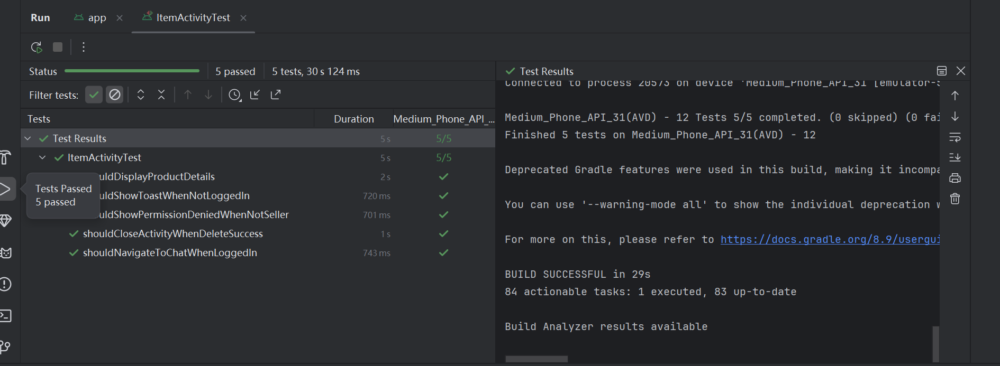
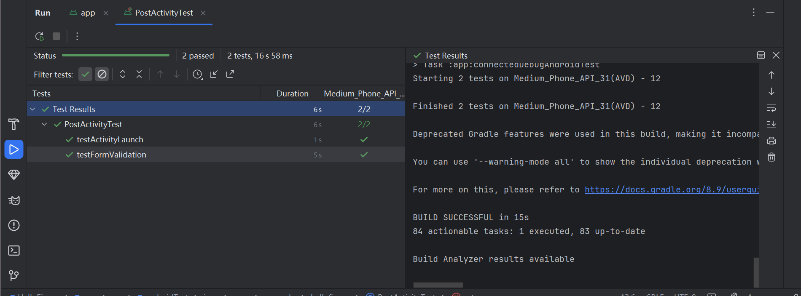
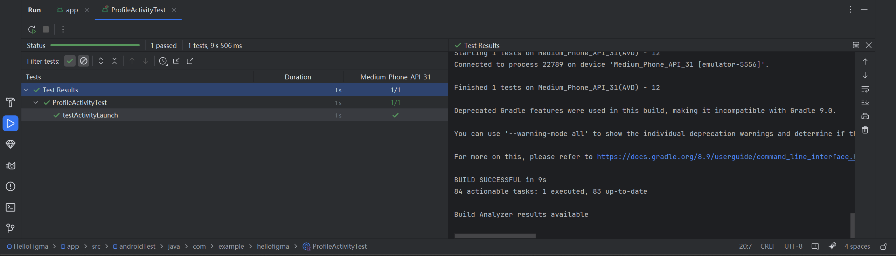

# Example M5: Testing and Code Review

## 1. Change History

| **Change Date**   | **Modified Sections** | **Rationale** |
| ----------------- | --------------------- | ------------- |
| _Nothing to show_ |

---

## 2. Back-end Test Specification: APIs

### 2.1. Locations of Back-end Tests and Instructions to Run Them

#### 2.1.1. Tests

| **Interface**                         | **Describe Group Location, No Mocks**                  | **Describe Group Location, With Mocks**              | **Mocked Components**              |
| ------------------------------------- | ---------------------------------------------------- | -------------------------------------------------- | ---------------------------------- |
| **POST /users/register**             | [`backend/tests/userNM.test.js#L35`](#)    | [`backend/tests/mocked/userM.test.js#L65`](#)    | Database (MySQL)                  |
| **GET /users/:id**                   | [`backend/tests/userNM.test.js#L80`](#)    | [`backend/tests/mocked/userM.test.js#L100`](#)   | Database (MySQL)                  |
| **PUT /users/:id**                   | [`backend/tests/userNM.test.js#L120`](#)   | [`backend/tests/mocked/userM.test.js#L150`](#)   | Database (MySQL)                  |
| **DELETE /users/:id**                | [`backend/tests/userNM.test.js#L160`](#)   | [`backend/tests/mocked/userM.test.js#L200`](#)   | Database (MySQL)                  |
| **GET /recommendations/:userId**     | [`backend/tests/recommendationNM.test.js#L35`](#)  | [`backend/tests/recommendationM.test.js#L65`](#)  | User Service (API), Listings Service (API) |
| **POST /price-suggestions**          | [`backend/tests/recommendationNM.test.js#L90`](#)  | [`backend/tests/recommendationM.test.js#L130`](#) | eBay API (SerpAPI)                 |
| **GET /price-comparison/:itemId**    | [`backend/tests/recommendationNM.test.js#L150`](#) | [`backend/tests/recommendationM.test.js#L200`](#) | Listings Service (API), eBay API (SerpAPI) |

## 4. Front-end Test Specification

### 4.1. The location of your front-end test suite

The front-end Espresso test suite files are located at:

- `frontend/HelloFigma/app/src/androidTest/java/com/example/hellofigma/ChatActivityTest.kt`
- `frontend/HelloFigma/app/src/androidTest/java/com/example/hellofigma/ItemActivityTest.kt`
- `frontend/HelloFigma/app/src/androidTest/java/com/example/hellofigma/MainScreenTest.kt`
- `frontend/HelloFigma/app/src/androidTest/java/com/example/hellofigma/PostActivityTest.kt`
- `frontend/HelloFigma/app/src/androidTest/java/com/example/hellofigma/ProfileActivityTest.kt`

---

### 4.2. Tests

#### Use Case: View Product Details

Expected Behaviors:

| Scenario Steps | Test Case Steps |
|----------------|-----------------|
| 1. User opens product detail screen | Launch `ItemActivity` with product details intent |
| 2. Product title, description, price, and image are displayed | Check title, description, price, image visibility |

Test Logs:

- `shouldDisplayProductDetails()`



---

#### Use Case: Delete Product

Expected Behaviors:

| Scenario Steps | Test Case Steps |
|----------------|-----------------|
| 1. User clicks delete button | Simulate click on delete button |
| 2. If not seller, system denies deletion | Check for content description message "You do not have permission to delete" |
| 3. If seller, product is deleted, activity closes | Check activity state is DESTROYED after deletion |

Test Logs:

- `shouldShowPermissionDeniedWhenNotSeller()`
- `shouldCloseActivityWhenDeleteSuccess()`


---

#### Use Case: Initiate Chat from Product

Expected Behaviors:

| Scenario Steps | Test Case Steps |
|----------------|-----------------|
| 1. Logged-in user clicks "I Want It" | Simulate logged-in state and click "I Want It" button |
| 2. ChatActivity is launched | Verify ChatActivity intent triggered |
| 3a. Not logged-in user clicks "I Want It" | Simulate not logged-in state and click "I Want It" button |
| 3a1. System shows toast message | Check for toast message "You haven't logged in yet" |

Test Logs:

- `shouldNavigateToChatWhenLoggedIn()`
- `shouldShowToastWhenNotLoggedIn()`


---

#### Use Case: Home Screen Navigation

Expected Behaviors:

| Scenario Steps | Test Case Steps |
|----------------|-----------------|
| 1. App loads main screen | Launch `MainActivity` |
| 2. Loading indicator is displayed | Check loading indicator visibility |
| 3. Bottom navigation bar buttons are displayed | Check buttons: Home, Categories, Messages, User |
| 4. User clicks pagination buttons | Click "Next Page" and "Last Page" buttons |

Test Logs:

- `testLoadingState()`
- `testBottomNavigationBarDisplay()`
- `testProductPaginationButtonDisplay()`
- `testNextPage()`
- `testLastPage()`


---

#### Use Case: Post New Product

Expected Behaviors:

| Scenario Steps | Test Case Steps |
|----------------|-----------------|
| 1. User opens post activity | Launch `PostActivity` |
| 2. All fields and buttons displayed | Check presence of title, description, price, location options, post button, etc. |
| 3. User leaves fields empty and tries posting | Click post button, check error messages |
| 4. User progressively fills fields, system validates each | Enter title, description, price one by one, check corresponding validations |

Test Logs:

- `testActivityLaunch()`
- `testFormValidation()`



---

#### Use Case: View Profile

Expected Behaviors:

| Scenario Steps | Test Case Steps |
|----------------|-----------------|
| 1. User opens profile screen | Launch `ProfileActivity` |
| 2. Profile screen loads successfully | Verify ProfileActivity launched correctly |

Test Logs:

- `testActivityLaunch()`



---

### 4.3. Espresso Execution Logs

The automated test execution logs:

```
> Task :app:connectedDebugAndroidTest
Starting 15 tests on Medium_Phone_API_35(AVD) - 15
Medium_Phone_API_35(AVD) - 15 Tests 15/15 completed. (0 skipped) (0 failed)
Finished 15 tests on Medium_Phone_API_35(AVD) - 15

BUILD SUCCESSFUL in 52s
```
