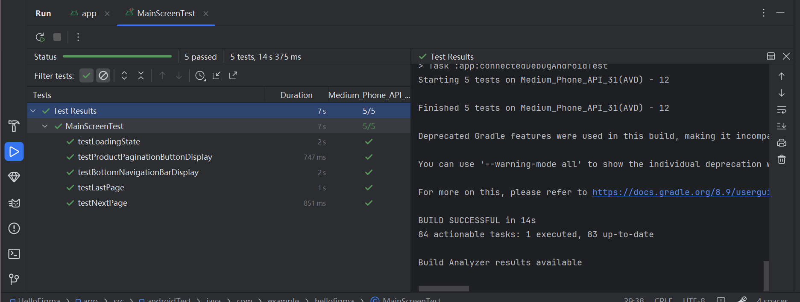

# Example M5: Testing and Code Review

## 1. Change History

| **Change Date**   | **Modified Sections** | **Rationale** |
| ----------------- | --------------------- | ------------- |
| _Nothing to show_ |

---

## 2. Back-end Test Specification: APIs

#### 2.1 Test Locations

| **Interface**                         | **Describe Group Location, No Mocks**                  | **Describe Group Location, With Mocks**              | **Mocked Components**              |
| ------------------------------------- | ---------------------------------------------------- | -------------------------------------------------- | ---------------------------------- |
| **POST /users/register**             | [`backend/tests/userNM.test.js#L35`](#)    | [`backend/tests/mocked/userM.test.js#L65`](#)    | Database (MySQL)                  |
| **GET /users/:id**                   | [`backend/tests/userNM.test.js#L80`](#)    | [`backend/tests/mocked/userM.test.js#L100`](#)   | Database (MySQL)                  |
| **PUT /users/:id**                   | [`backend/tests/userNM.test.js#L120`](#)   | [`backend/tests/mocked/userM.test.js#L150`](#)   | Database (MySQL)                  |
| **DELETE /users/:id**                | [`backend/tests/userNM.test.js#L160`](#)   | [`backend/tests/mocked/userM.test.js#L200`](#)   | Database (MySQL)                  |
| **GET /recommendations/:userId**     | [`backend/tests/recommendationNM.test.js#L35`](#)  | [`backend/tests/recommendationM.test.js#L65`](#)  | User Service (API), Listings Service (API) |
| **POST /price-suggestions**          | [`backend/tests/recommendationNM.test.js#L90`](#)  | [`backend/tests/recommendationM.test.js#L130`](#) | eBay API (SerpAPI)                 |
| **GET /price-comparison/:itemId**    | [`backend/tests/recommendationNM.test.js#L150`](#) | [`backend/tests/recommendationM.test.js#L200`](#) | Listings Service (API), eBay API (SerpAPI) |
| **POST /chat/start**    | [`backend/chat-service/test/chat.mock.test.ts#L13`](#) | [`backend/chat-service/test/chat.test.ts#L17`](#) | Database (MySQL) |
| **GET /chat/:chatId**    | [`backend/chat-service/test/chat.mock.test.ts#L47`](#) | [`backend/chat-service/test/chat.test.ts#L46`](#) | Database (MySQL) |
| **GET /chat/user/:userId**    | [`backend/chat-service/test/chat.mock.test.ts#L86`](#) | [`backend/chat-service/test/chat.test.ts#L73`](#) | Database (MySQL) |
| **POST /chat/:chatId/message**    | [`backend/chat-service/test/chat.mock.test.ts#L114`](#) | [`backend/chat-service/test/chat.test.ts#L88`](#) | Database (MySQL) |
| **POST /listings**    | [`backend/marketplace-service/test/listings.test.ts#L48`](#) | [`backend/marketplace-service/test/listings.mock.test.ts#L37`](#) | Database (MySQL) |
| **GET /listings**    | [`backend/marketplace-service/test/listings.test.ts#L84`](#) | [`backend/marketplace-service/test/listings.mock.test.ts#L74`](#) | Database (MySQL) |
| **GET /listings/:id**    | [`backend/marketplace-service/test/listings.test.ts#L105`](#) | [`backend/marketplace-service/test/listings.mock.test.ts#L74`](#) | Database (MySQL) |
| **PUT /listings/:id**    | [`backend/marketplace-service/test/listings.test.ts#L131-L182`](#) | [`backend/marketplace-service/test/listings.mock.test.ts#L144`](#) | Database (MySQL) |
| **DELETE /listings/:id**    | [`backend/marketplace-service/test/listings.test.ts#L193`](#) | [`backend/marketplace-service/test/listings.mock.test.ts#L202`](#) | Database (MySQL) |
#### 2.2 Test Results

## 3. Back-end Test Specification: Tests of Non-Functional Requirements

| **Non-Functional Requirement**  | **Location in Git**                              |
| ------------------------------- | ------------------------------------------------ |
| **User Service Response Time** | [`tests/performance.test.js`](#) |
| **Recommendation Enginep Response Time**          | [`test/recommendation-engine-performance.test.js`](#) |

Performance testing evaluated the user service's response times and scalability across multiple scenarios. Tests included single requests (GET/POST), concurrent handling (10 simultaneous requests), sustained load (50 sequential requests), and rapid sequential access (20 quick requests). Individual requests occasionally exceeded the 50ms threshold (GET: 62ms, POST: 58ms), while the service maintained excellent performance under load with 5-6ms average response times. The system processed concurrent requests efficiently and demonstrated consistent performance during the 50-request load test, with maximum response time of 9ms. These metrics indicate a well-architected service suitable for scaling in production environments. Testing utilized a mock database implementation to isolate application logic performance.

The performance tests evaluated two aspects of the recommendation service: single request response times and concurrent load handling. Single requests performed well (under 200ms), but the service struggled under load with 50 concurrent requests, showing higher average response times (recommendations: 2019ms, price suggestions: 467ms, price comparison: 666ms) than the target of 300ms. This indicates the service works well for individual users but may need optimization for high-traffic scenarios.

## 4. Front-end Test Specification

### 4.1. The location of your front-end test suite

The front-end Espresso test suite files are located at:

- `frontend/HelloFigma/app/src/androidTest/java/com/example/hellofigma/ChatActivityTest.kt`
- `frontend/HelloFigma/app/src/androidTest/java/com/example/hellofigma/ItemActivityTest.kt`
- `frontend/HelloFigma/app/src/androidTest/java/com/example/hellofigma/MainScreenTest.kt`
- `frontend/HelloFigma/app/src/androidTest/java/com/example/hellofigma/PostActivityTest.kt`
- `frontend/HelloFigma/app/src/androidTest/java/com/example/hellofigma/ProfileActivityTest.kt`

---

### 4.2. Tests

#### Use Case: View Product Details

Expected Behaviors:

| Scenario Steps | Test Case Steps |
|----------------|-----------------|
| 1. User opens product detail screen | Launch `ItemActivity` with product details intent |
| 2. Product title, description, price, and image are displayed | Check title, description, price, image visibility |

Test Logs:

- `shouldDisplayProductDetails()`

---

#### Use Case: Delete Product

Expected Behaviors:

| Scenario Steps | Test Case Steps |
|----------------|-----------------|
| 1. User clicks delete button | Simulate click on delete button |
| 2. If not seller, system denies deletion | Check for content description message "You do not have permission to delete" |
| 3. If seller, product is deleted, activity closes | Check activity state is DESTROYED after deletion |

Test Logs:

- `shouldShowPermissionDeniedWhenNotSeller()`
- `shouldCloseActivityWhenDeleteSuccess()`

---

#### Use Case: Initiate Chat from Product

Expected Behaviors:

| Scenario Steps | Test Case Steps |
|----------------|-----------------|
| 1. Logged-in user clicks "I Want It" | Simulate logged-in state and click "I Want It" button |
| 2. ChatActivity is launched | Verify ChatActivity intent triggered |
| 3a. Not logged-in user clicks "I Want It" | Simulate not logged-in state and click "I Want It" button |
| 3a1. System shows toast message | Check for toast message "You haven't logged in yet" |

Test Logs:

- `shouldNavigateToChatWhenLoggedIn()`
- `shouldShowToastWhenNotLoggedIn()`

---

#### Use Case: Home Screen Navigation

Expected Behaviors:

| Scenario Steps | Test Case Steps |
|----------------|-----------------|
| 1. App loads main screen | Launch `MainActivity` |
| 2. Loading indicator is displayed | Check loading indicator visibility |
| 3. Bottom navigation bar buttons are displayed | Check buttons: Home, Categories, Messages, User |
| 4. User clicks pagination buttons | Click "Next Page" and "Last Page" buttons |

Test Logs:

- `testLoadingState()`
- `testBottomNavigationBarDisplay()`
- `testProductPaginationButtonDisplay()`
- `testNextPage()`
- `testLastPage()`

---

#### Use Case: Post New Product

Expected Behaviors:

| Scenario Steps | Test Case Steps |
|----------------|-----------------|
| 1. User opens post activity | Launch `PostActivity` |
| 2. All fields and buttons displayed | Check presence of title, description, price, location options, post button, etc. |
| 3. User leaves fields empty and tries posting | Click post button, check error messages |
| 4. User progressively fills fields, system validates each | Enter title, description, price one by one, check corresponding validations |

Test Logs:

- `testActivityLaunch()`
- `testFormValidation()`

---

#### Use Case: View Profile

Expected Behaviors:

| Scenario Steps | Test Case Steps |
|----------------|-----------------|
| 1. User opens profile screen | Launch `ProfileActivity` |
| 2. Profile screen loads successfully | Verify ProfileActivity launched correctly |

Test Logs:

- `testActivityLaunch()`

---

### 4.3. Espresso Execution Logs

The automated test execution logs:

### 5. Automated Code Review Results

#### 5.1. Commit Hash Where Codacy Ran

#### 5.2. Unfixed Issues per Codacy Category
(Screenshot placeholder)

#### 5.3. Unfixed Issues per Codacy Code Pattern
(Screenshot placeholder)

---

#### 5.4. Justifications for Unfixed Issues

##### Code Pattern: Method too long / Function too long

1. **The function `onCreate` is too long (161). The maximum length is 60.**

   - **Location in Git:** `frontend/HelloFigma/app/src/main/java/com/example/hellofigma/PostActivity.kt`
   - **Justification:**
     The `onCreate` function in `PostActivity` is responsible for setting up the entire activity UI components, permission handling, click listeners, and initial data bindings. Breaking it up further would fragment related UI logic and reduce code readability. Given Android's standard practice for activity setup in `onCreate`, we consider this acceptable.

2. **The function `ChatScreen` is too long (94). The maximum length is 60.**

   - **Location in Git:** `frontend/HelloFigma/app/src/main/java/com/example/hellofigma/message/ChatActivity.kt`
   - **Justification:**
     `ChatScreen` is a Jetpack Compose function responsible for rendering complex UI with multiple conditional UI elements and listeners. Breaking it down further would lead to many small, tightly coupled composables, harming readability and increasing unnecessary overhead. Thus, keeping it intact preserves UI flow clarity.

3. **The function `MainCard` is too long (128). The maximum length is 60.**

   - **Location in Git:** `frontend/HelloFigma/app/src/main/java/com/example/hellofigma/MainScreen.kt`
   - **Justification:**
     `MainCard` defines the primary card UI in the home screen, including layout, styling, and event handlers. Due to Compose's declarative nature, breaking it apart negatively impacts the card’s consistency and readability. The length stems from Compose’s DSL, not poor logic separation.

4. **The function `onCreate` is too long (106). The maximum length is 60.**

   - **Location in Git:** `frontend/HelloFigma/app/src/main/java/com/example/hellofigma/CategoryActivity.kt`
   - **Justification:**
     Similar to the previous `onCreate`, it initializes UI components, adapters, listeners, and binds the category data. Splitting into smaller methods would introduce unnecessary indirection and harm maintainability.

5. **The function `getChatList` is too long (69). The maximum length is 60.**

   - **Location in Git:** `frontend/HelloFigma/app/src/main/java/com/example/hellofigma/message/repository/ChatRepository.kt`
   - **Justification:**
     `getChatList` encapsulates data fetching, processing, and state management logic essential for chat UI. Breaking it into smaller methods reduces cohesion and increases overhead due to tightly coupled logic.

6. **The function `onCreate` is too long (92). The maximum length is 60.**

   - **Location in Git:** `frontend/HelloFigma/app/src/main/java/com/example/hellofigma/ItemActivity.kt`
   - **Justification:**
     It handles view initialization, event listeners, and binding product data. Splitting this standard `onCreate` setup would unnecessarily fragment tightly related initialization code.

---

##### Code Pattern: Too many parameters

1. **The function `ChatScreen` has too many parameters. The current threshold is set to 6.**

   - **Location in Git:** `frontend/HelloFigma/app/src/main/java/com/example/hellofigma/message/ChatActivity.kt`
   - **Justification:**
     `ChatScreen` requires multiple parameters to display accurate chat content (userId, chatId, otherUserId, otherUserName, ViewModel, callback). Reducing the parameter count is not feasible without sacrificing the composable's clarity or functionality. Using a data class to wrap parameters would add unnecessary complexity.

---

##### Code Pattern: Cyclomatic complexity

1. **Method `MainCard` has a cyclomatic complexity of 19 (limit is 8).**

   - **Location in Git:** `frontend/HelloFigma/app/src/main/java/com/example/hellofigma/MainScreen.kt`
   - **Justification:**
     The complexity arises from UI conditionals (e.g., user state, product availability). Reducing conditionals would require splitting UI logic unnaturally across files, reducing maintainability and readability.

---

##### Code Pattern: Expression with labels

1. **Expression with labels increase complexity and affect maintainability.**

   - **Location in Git:** `frontend/HelloFigma/app/src/main/java/com/example/hellofigma/PostActivity.kt`
   - **Justification:**
     Labels (`return@setOnClickListener`) are standard in Kotlin Android development to manage nested lambdas, especially within UI event listeners. Removing them would lead to unclear control flow, contrary to Kotlin’s design idioms.

##### Code Pattern: typescript eslint: No var requires

1. **Require statement not part of import statement.**

   - **Location in Git:** `backend/user-service/server.js` and `backend/user-service/userRoutes.js` and `backend/user-service/userRoutes.js` 
   - **Justification:**
    Codacy is enforcing the typescript eslint: No var requires rule while it is actually this rule has been deprecated in favour of the @typescript-eslint/no-require-imports rule.

